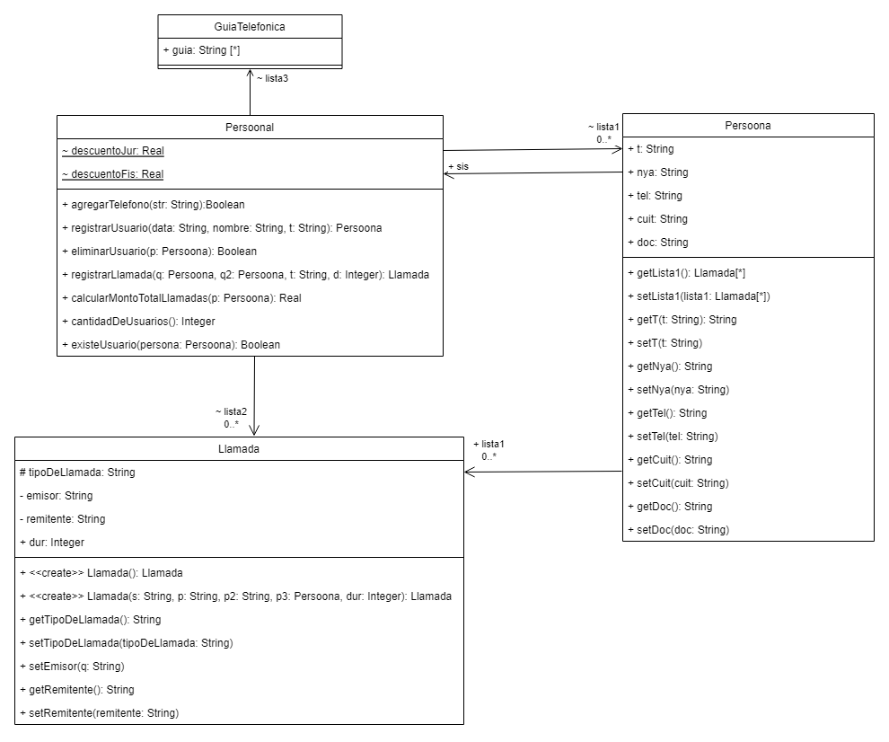
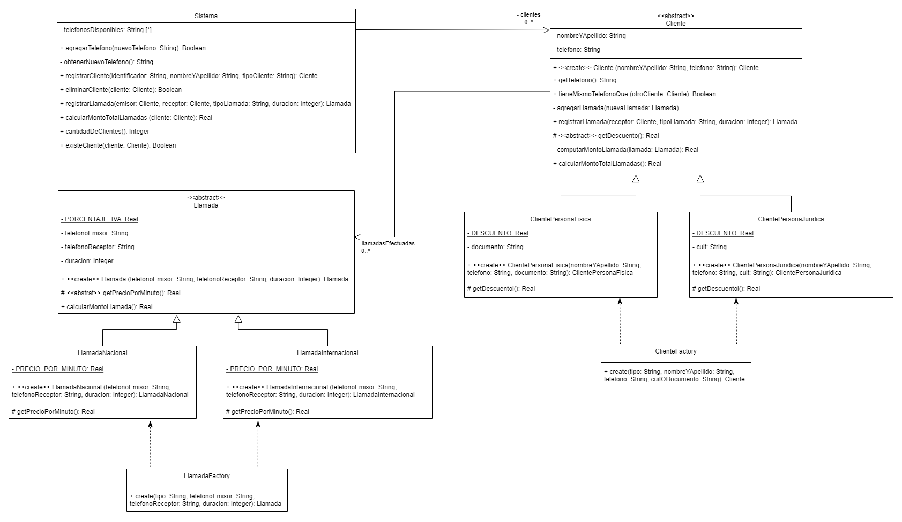

# Refactor Ejercicio 3

## Enunciado

Ejercicio 3 - Facturación de llamadas

> Importante: Aprobando este ejercicio, no será necesario rendir el tema Refactoring en el parcial.
>
> Fecha límite de entrega: 24/05/2023 23:59 hs (máximo 2 integrantes por grupo).

El material adicional se corresponde con una aplicación de registro y facturación de llamadas telefónicas. Para lograr tal objetivo, la aplicación permite administrar números telefónicos, como así también clientes asociados a un número. Los clientes pueden ser personas físicas o jurídicas. Además, el sistema permite registrar las llamadas realizadas, las cuales pueden ser nacionales o internacionales. Luego, a partir de las llamadas, la aplicación realiza la facturación, es decir, calcula el monto que debe abonar cada cliente.

Importe el material adicional provisto por la cátedra y analícelo para identificar y corregir los malos olores que presenta. En forma iterativa, realice los siguientes pasos:

1. indique el mal olor
1. indique el refactoring que lo corrige
1. aplique el refactoring (modifique el código)
1. asegúrese de que los tests provistos corran exitosamente

> Si vuelve a encontrar un mal olor, retorne al paso 1.

Ud debe entregar:

- Un diagrama de clases UML con el diseño inicial de la solución provista
- La secuencia de refactorings aplicados, documentados cada uno de la siguiente manera:
  - Mal olor detectado en el código
  - Extracto del código que presenta el mal olor
  - Refactoring a aplicar que resuelve el mal olor
  - Código con el refactoring aplicado
- Un diagrama de clases UML con el diseño final
- El código java refactorizado

> **Importante:** asegúrese de que no queden malos olores por identificar y refactorizar.

## UML inicial del codigo

El diagrama en UML que representa el codigo en su estado previo al proceso de refactorizacion es:

## UML final del codigo

El diagrama en UML que representa el codigo en su estado posterior al proceso de refactorizacion es:

<!--  -->
